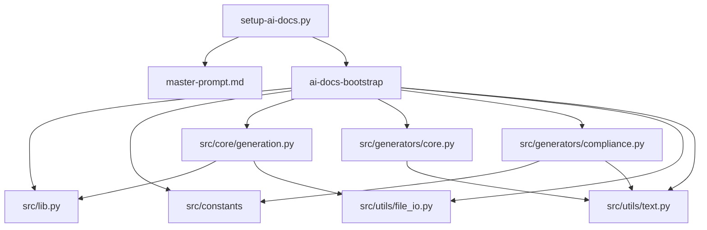

# Coding Agent Architecture

## Purpose

This document defines the current module structure, ownership boundaries, and runtime flow for the AI docs generator.

## Runtime Model

The repository has two execution modes:

1. Builder mode via `setup-ai-docs.py`
2. Drop-in runtime mode via generated `ai-docs-bootstrap`

Builder mode packages selected source functions into a standalone bootstrap script.
Runtime mode executes documentation generation in any target project.

## Top-Level Flow

1. `setup-ai-docs.py` reads `master-prompt.md`.
2. `setup-ai-docs.py` builds and writes `ai-docs-bootstrap`.
3. `ai-docs-bootstrap` detects target project type and stack.
4. `ai-docs-bootstrap` builds generation context.
5. Generator modules render markdown/spec outputs.
6. Utility modules write files, changelog, and metadata.

## Module Responsibilities

### `setup-ai-docs.py`

- Builder and local entrypoint.
- Assembles embedded runtime code for `ai-docs-bootstrap`.
- Handles target OS profile selection and bootstrap output mode.

### `src/constants/`

- `compliance.py`: compliance catalog + aliases.
- `hints.py`: framework hints + package guidance + security audit command defaults.
- `presets.py`: stack presets and app-intent blueprint presets.

### `src/lib.py`

- Shared domain and detection helpers.
- App-intent ranking, compliance-pack resolution, stack detection support, hashing, and utility functions reused by generation paths.

### `src/core/`

- `generation.py`: context building, scope-change detection, impacted-file detection, metadata lifecycle.

### `src/generators/`

- `core.py`: AGENTS, blueprint, context snapshot, index, and agent-specific docs.
- `compliance.py`: Level 2 scanning docs + Level 3 implementation pattern docs.
- `documentation.py`: additional documentation generator surface and composition helpers.

### `src/utils/`

- `file_io.py`: write/read/normalize helpers, changelog updates, metadata JSON helper, markdown context scan.
- `text.py`: string normalization, slug and keyword helper utilities.

## Dependency Diagram

## Ownership Boundaries

- Intent/compliance selection logic should remain in `src/lib.py` and `src/constants/`.
- File write and normalization logic should remain in `src/utils/file_io.py`.
- Markdown rendering logic should remain in `src/generators/`.
- Generation orchestration and metadata decisions should remain in `src/core/generation.py`.

## Extension Rules

1. New output files: add generator functions under `src/generators/` first.
2. New compliance frameworks: update `src/constants/compliance.py` and then `src/generators/compliance.py`.
3. New stack heuristics: update stack/preset logic in `src/lib.py` and `src/constants/presets.py`.
4. Keep `setup-ai-docs.py` focused on bootstrap assembly and CLI flow.
